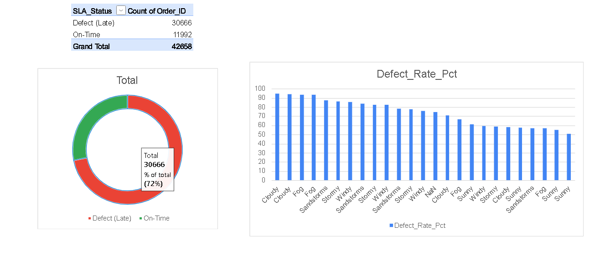

# Amazon Last-Mile Delivery Performance & Defect Analysis

## Project Overview
This project simulates the role of a Transportation Specialist by analyzing a dataset of 43,000+ last-mile delivery records. The goal was to establish delivery Service Level Agreement (SLA) baselines, identify recurring transit bottlenecks, and perform root-cause analysis on delayed shipments. 

## Tech Stack Used
* **SQL (MySQL):** Data extraction, cleaning, and aggregation. Utilized Common Table Expressions (CTEs), Window Functions, and complex JOINs.
* **Microsoft Excel:** Data modeling, PivotTables, INDEX/MATCH, and dynamic stakeholder dashboard creation.

## Key Business Questions Answered
1. **SLA Compliance:** What percentage of deliveries meet the 90-minute target?
2. **Root Cause Analysis:** How do specific weather conditions and traffic density compound to create delivery defects?
3. **Network Bottlenecks:** Which product categories experience the highest delays partitioned by urban vs. metropolitan areas?
4. **Agent Performance Variance:** Which specific deliveries fell significantly behind their regional averages, requiring targeted process improvements?

## Data Engineering Workflow
The raw dataset was loaded into a local MySQL instance. I engineered a series of SQL pipelines to clean null values and aggregate the raw data into optimized CSV outputs. These outputs were then connected to an Excel dashboard to simulate stakeholder reporting. 

*(Note: The full SQL extraction scripts can be found in the `queries.sql` file attached to this repository).*
